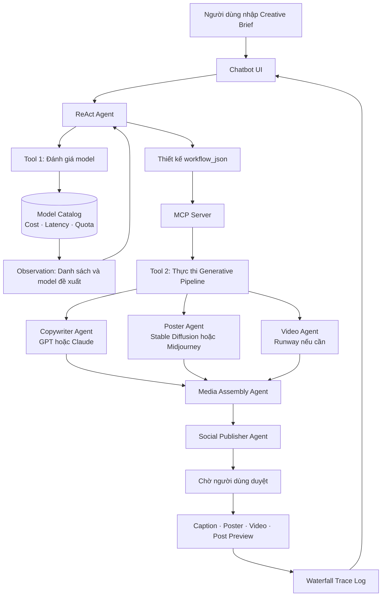

# KỊCH BẢN TRÌNH BÀY DEMO DAY 3

## AI Creative Director & Prompt Pipeline Optimizer

**Thời lượng đề xuất:** 7–9 phút  
**Người trình bày:** Lê Nguyễn Quốc Bảo  
**Mục tiêu:** Trình bày bài toán, mức độ phù hợp với Agent, kiến trúc, hai công cụ MCP và demo trực tiếp có trace log.

---

## 0. Chuẩn bị trước khi trình bày

1. Chạy ứng dụng bằng lệnh:

   ```bash
   python demo/server.py
   ```

2. Mở địa chỉ được in trên terminal, thông thường là `http://127.0.0.1:8000`.
3. Kiểm tra góc trái giao diện hiển thị backend đã kết nối.
4. Nếu Gemini hoặc OpenAI không khả dụng, giữ nguyên chế độ Mock. Giao diện sẽ ghi rõ đây là **Demo mô phỏng**, không tuyên bố đã sinh media hoặc đăng bài thật.
5. Chuẩn bị sẵn hai câu lệnh demo ở phần cuối tài liệu để tránh mất thời gian nhập.

---

## 1. Mở đầu và giới thiệu đề tài — khoảng 1 phút

**Thao tác trên màn hình:** Mở trang chủ của Creative Flow AI.

**Lời trình bày:**

> Xin chào thầy cô và mọi người. Đề tài của em là **AI Creative Director & Prompt Pipeline Optimizer**, hay Trợ lý tối ưu quy trình và Prompt Engineering cho Media & Design.
>
> Trong một chiến dịch truyền thông, người dùng có thể cần caption, poster, video và bài đăng trên mạng xã hội. Mỗi loại nội dung lại phù hợp với một model khác nhau. Ví dụ, GPT hoặc Claude xử lý nội dung; Stable Diffusion hoặc Midjourney tạo hình ảnh; Runway tạo video.
>
> Nếu chọn model thủ công, người dùng phải tự so sánh chất lượng, chi phí, độ trễ và hạn ngạch API. Sau đó họ còn phải tự nối nhiều bước: viết caption, sinh media, ghép nội dung và chuẩn bị đăng bài. Quy trình này mất thời gian và dễ chọn sai công cụ.
>
> Vì vậy, em xây dựng một Agent nhận creative brief bằng ngôn ngữ tự nhiên, tự đánh giá yêu cầu, tra cứu phương án, lựa chọn model, tạo workflow rồi yêu cầu MCP Server thực thi pipeline.

**Câu chốt:**

> Giá trị chính của đề tài không chỉ là sinh một nội dung, mà là tự động đưa ra quyết định và điều phối toàn bộ quy trình GenAI.

---

## 2. Tại sao ReAct Agent Pattern phù hợp? — khoảng 1 phút 30 giây

**Lời trình bày:**

> Em sử dụng ReAct Agent Pattern, trong đó Agent lặp qua ba thành phần: **Thought – Action – Observation**.
>
> Thought là phân tích brief và xác định thông tin còn thiếu. Action là chọn và gọi công cụ phù hợp. Observation là kết quả có cấu trúc do công cụ trả về. Agent dùng Observation thật làm đầu vào cho quyết định tiếp theo, thay vì tự đoán chi phí hoặc kết quả pipeline.

### Bốn tiêu chí Agent Fit

| Tiêu chí | Điểm | Nội dung trình bày |
|---|:---:|---|
| Multi-step Reasoning | 5/5 | Phải phân tích brief, đánh giá độ phức tạp, xác định media, tra cứu model, so sánh chi phí, chọn model, xây workflow và thực thi. |
| Tool Interaction | 5/5 | Agent cần gọi Tool 1 để tra cứu dữ liệu vận hành và Tool 2 để kích hoạt pipeline qua MCP Server. |
| Dynamic Decision | 5/5 | Model và workflow thay đổi theo loại media, độ phức tạp, chi phí, độ trễ và hạn ngạch; không dùng một cấu hình cố định. |
| Long Horizon Goal | 4/5 | Agent phải giữ mục tiêu, đối tượng, kênh, ngân sách và deliverables xuyên suốt pipeline, nhưng chưa theo dõi chiến dịch trong nhiều ngày. |

**Lời trình bày tiếp:**

> Tổng điểm Agentic Fit của đề tài là **19 trên 20**, lớn hơn ngưỡng 12. Vì vậy đây là bài toán phù hợp để xây dựng Agent thay vì chatbot hỏi–đáp thông thường.
>
> Nếu chỉ dùng chatbot thông thường, model có thể đề xuất một phương án bằng văn bản. Với ReAct Agent, hệ thống có thể kiểm chứng thông tin qua tool, thay đổi quyết định theo Observation và thực thi bước tiếp theo.

---

## 3. Workflow và kiến trúc Agent — khoảng 1 phút 30 giây



**Lời trình bày:**

> Đây là workflow tổng thể. Người dùng chỉ cần nhập brief tại UI. ReAct Agent trước tiên gọi Tool 1 để đọc catalog gồm chi phí, độ trễ và hạn ngạch.
>
> Observation của Tool 1 được đưa lại vào Agent. Từ đó Agent mới chọn model và tạo `workflow_json`. Workflow được gửi qua MCP Server tới Tool 2.
>
> Tool 2 điều phối các agent chuyên biệt: Copywriter Agent, Poster Design Agent, Video Creative Agent, Media Assembly Agent và Social Publisher Agent. Cuối cùng, kết quả được đặt ở chế độ chờ duyệt và toàn bộ từng bước được ghi vào trace log.
>
> Thiết kế này có một nguyên tắc an toàn: Social Publisher trong bản demo không đăng thật. Thuộc tính `external_side_effect` luôn là `false` và người dùng phải duyệt trước.

---

## 4. Hai công cụ được xây dựng — khoảng 1 phút

### Tool 1 — `evaluate_model_cost_and_latency`

**Đầu vào:**

- `task_complexity`: `low`, `medium` hoặc `high`.
- `media_type`: `text`, `image`, `video` hoặc `multimodal`.

**Công dụng:**

> Tool này tra cứu catalog model và trả về các model khả dụng, chi phí ước tính, độ trễ và hạn ngạch còn lại. Sau đó tool đề xuất tổ hợp text model, image model và video model phù hợp. Tool 1 chỉ đọc dữ liệu, không sinh nội dung và không tạo tác động bên ngoài.

### Tool 2 — `execute_generative_pipeline`

**Đầu vào:** `workflow_json`, gồm tên chiến dịch, mục tiêu, đối tượng, kênh, model đã chọn, deliverables và chế độ xuất bản.

**Công dụng:**

> Tool 2 kiểm tra workflow, tạo `run_id` và điều phối các agent sinh caption, poster hoặc video. Tiếp theo hệ thống ghép media với caption và chuẩn bị bản xem trước của bài đăng. Kết quả trả về gồm trạng thái từng bước, artifacts, tổng chi phí pipeline và trạng thái xuất bản.

**Câu chốt:**

> Tool 1 giúp Agent **quyết định**, còn Tool 2 giúp Agent **hành động**.

---

## 5. Demo trực tiếp có trace log — khoảng 2–3 phút

### Demo 1 — Caption và poster với ngân sách tiết kiệm

**Thao tác:** Chọn thẻ “Ra mắt thương hiệu cà phê” hoặc nhập câu sau:

> Tạo chiến dịch Facebook và Instagram ra mắt cà phê rang xay Mộc Nhiên cho người trẻ 22–30 tuổi, gồm caption và key visual, ưu tiên chi phí hợp lý.

**Lời dẫn trong lúc hệ thống chạy:**

> Ở đây người dùng không chỉ định model. Agent phải tự hiểu đây là bài toán đa phương tiện có độ phức tạp trung bình.

**Khi có kết quả, chỉ lần lượt trên UI và nói:**

> Ở phần chi phí, Agent đã chọn GPT cho caption và Stable Diffusion cho poster theo chiến lược cân bằng chi phí và độ trễ.
>
> Tiếp theo là workflow MCP. Copywriter Agent tạo caption, Poster Design Agent tạo poster, Media Assembly Agent ghép nội dung và Social Publisher Agent chuẩn bị bản đăng.
>
> Phía dưới là caption, poster preview và bản xem trước của bài đăng Facebook. Đây là artifact demo, chưa được đăng thật.

**Mở “Xem quá trình Agent xử lý” và trình bày:**

> Trace log cho thấy ba lượt chính. Step 1 gọi `evaluate_model_cost_and_latency`. Step 2 gọi `execute_generative_pipeline`. Step 3 là Final Answer sau khi Agent đã có đủ Observation. Đây chính là vòng lặp ReAct.

### Demo 2 — Pipeline có video

**Thao tác:** Tạo cuộc trò chuyện mới, chọn “Video ra mắt sản phẩm” hoặc nhập:

> Tạo chiến dịch TikTok và Facebook ra mắt tai nghe thể thao, gồm caption, poster và video dọc 15 giây; tính chi phí rồi mô phỏng đăng bài Facebook.

**Lời trình bày:**

> Ở ví dụ thứ hai, Agent nhận diện deliverable video nên chọn `media_type` là video. Tool 1 đề xuất GPT, Stable Diffusion và Runway.
>
> Chi phí model mô phỏng là khoảng 0,46 USD. Khi cộng bước Media Assembly, tổng pipeline là khoảng 0,47 USD. Các số liệu này là catalog giả lập phục vụ bài lab, không phải bảng giá thương mại thực tế.
>
> Workflow lần này có năm agent step: tạo caption, tạo poster, tạo video, ghép media và chuẩn bị đăng Facebook. UI hiển thị video storyboard 15 giây gồm hook, phần giới thiệu sản phẩm và call-to-action.
>
> Cuối cùng, bài đăng có caption, poster và video đính kèm nhưng trạng thái vẫn là `SIMULATED_READY_TO_PUBLISH`. Điều đó chứng minh pipeline đã đi tới bước xuất bản mà vẫn đảm bảo human-in-the-loop.

---

## 6. Kết luận — khoảng 30 giây

**Lời trình bày:**

> Qua demo, hệ thống đã thể hiện đủ ba năng lực của ReAct: suy luận từ brief, sử dụng công cụ để lấy Observation và hành động bằng một workflow động.
>
> Phiên bản hiện tại sử dụng pipeline mô phỏng cho các dịch vụ sinh ảnh, video và Facebook khi API miễn phí không khả dụng. Tuy nhiên, các điểm tích hợp đã được tách qua MCP và có schema rõ ràng, nên có thể thay execution layer bằng API thật mà không phải thay đổi toàn bộ Agent.
>
> Hướng phát triển tiếp theo là kết nối API tạo media thật, Facebook Graph API, bổ sung bước phê duyệt trên UI và thu thập số liệu hiệu quả chiến dịch để Agent tiếp tục tối ưu ở những vòng sau.
>
> Em xin kết thúc phần trình bày. Cảm ơn thầy cô và mọi người đã lắng nghe.

---

## 7. Câu trả lời dự phòng khi được hỏi

### “Tại sao không để LLM tự chọn model mà cần Tool 1?”

> Vì giá, hạn ngạch và độ trễ là dữ liệu vận hành có thể thay đổi. Nếu để LLM tự trả lời từ kiến thức có sẵn, kết quả có thể bị bịa hoặc lỗi thời. Tool 1 tạo một nguồn dữ liệu có cấu trúc để Agent ra quyết định dựa trên Observation.

### “MCP có thực sự được gọi không?”

> Có. ReAct loop gọi `MCPGenerativePipelineServer.call_tool()`, MCP Server định tuyến tới đúng execution function và trả Observation theo cấu trúc JSON-RPC. Phần được mô phỏng là API media và thao tác đăng lên nền tảng bên ngoài, không phải luồng gọi MCP.

### “Tại sao chưa đăng Facebook thật?”

> Đăng bài là tác động bên ngoài và cần Page Access Token cùng quyền của Facebook Graph API. Trong phạm vi bài lab, hệ thống dùng chế độ `review_required`, tạo post preview và không thực hiện tác động bên ngoài. Đây cũng là cơ chế human-in-the-loop an toàn.

### “Chi phí hiển thị có phải giá thật không?”

> Không. Đây là chi phí ước tính từ mock model catalog để chứng minh logic tối ưu. Khi triển khai thực tế, Tool 1 sẽ đọc pricing và quota từ API hoặc hệ thống billing thật.

### “Điểm khác biệt với chatbot thông thường là gì?”

> Chatbot thông thường chủ yếu sinh một câu trả lời. Agent này duy trì mục tiêu qua nhiều bước, chủ động chọn tool, đọc Observation, thay đổi workflow và kích hoạt hành động qua MCP.
